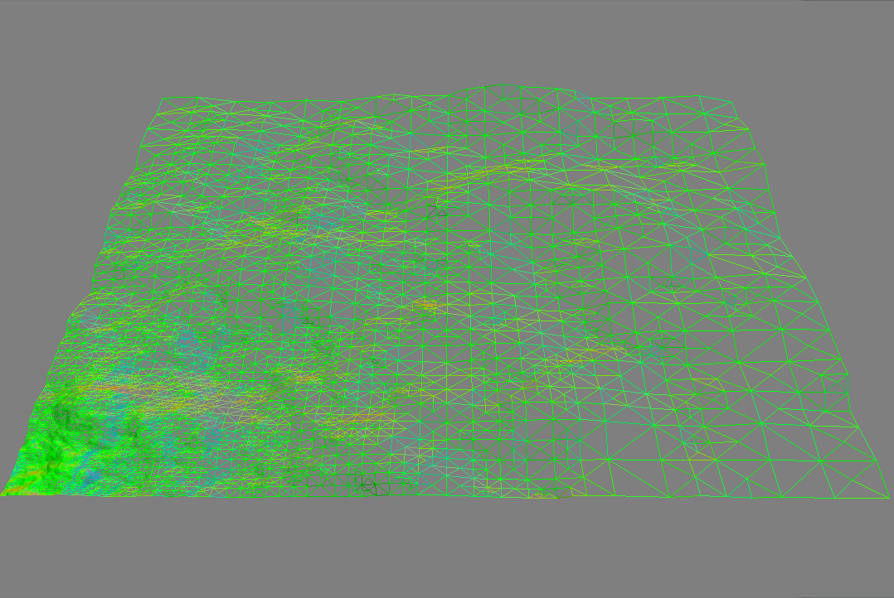

# roam-terrain-generator

roam-terrain-generator is an experimental program that generates infinite landscapes using a modified
"split-only" version of [ROAM](https://graphics.llnl.gov/ROAM/roam.pdf) for level of detail (LOD).

## Features
- Uses a chunking algorithm to generate infinite terrain
- Uses ROAM algorithm to determine LOD for each terrain chunk
- Multithreaded implementation allows terrain LOD to be updated efficiently
- Applies textures procedurally based on the slope of the land
- Generates grass blades with instancing (previously done with a geometry shader)

## Setup and Build
Place any images called `dirt.jpg`, `grass.jpg`, `grass_blades.png`, and `rock.jpg` into
`TerrainGenerator/textures`. These textures will used when rendering the landscape.
(Some potential textures: [dirt](https://www.textures.com/download/soilrough0039/8661),
 [grass](http://texturelib.com/texture/?path=/Textures/grass/grass/grass_grass_0048),
 [grass-blades](https://opengameart.org/content/grass-blades-alpha-card-texture-side-view),
 [rock](https://www.textures.com/download/cliffs0464/94319))

This project has the following dependencies:
- OpenGL 3.3
- SDL 2.0.7
- GLEW 2.1.0
- GLM 0.9.8.5
- libnoise
- Simple OpenGL Image Library (SOIL)

CMake 3.8+ is required to generate the build files. From the top-level project directory, run the following commands:
```shell
mkdir build
cd build
cmake ../
```
Dependencies are resolved using CMake's internal Find scripts and custom Find scripts in the `cmake` directory.
If a dependency cannot be located, try modifying the paths in the top-level `CMakeLists.txt`.

## Controls
- **Mousemove**: Look around
- **W**: Move forward
- **A**: Move left
- **S**: Move backward
- **D**: Move right
- **E**: Switch between walk mode and fly mode
- **R**: Toggle wireframe mode on/off
- **Spacebar**: Fly up (fly mode only)
- **Shift**: Fly down (fly mode only)
- **ESC**: Exit the program

## Notes/Limitations
- Cracks can form in the terrain due to differences in level of detail between terrain chunks.

## Images
Wireframe for a single terrain chunk with the greatest number of triangles in the lower left corner
(where the viewer would be located):


